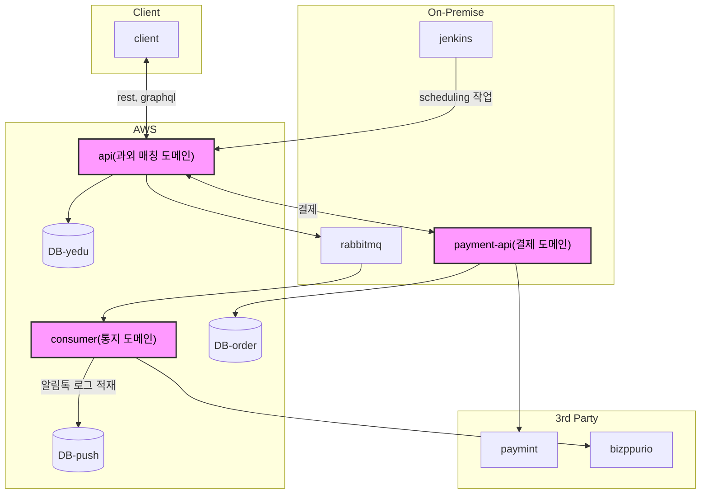
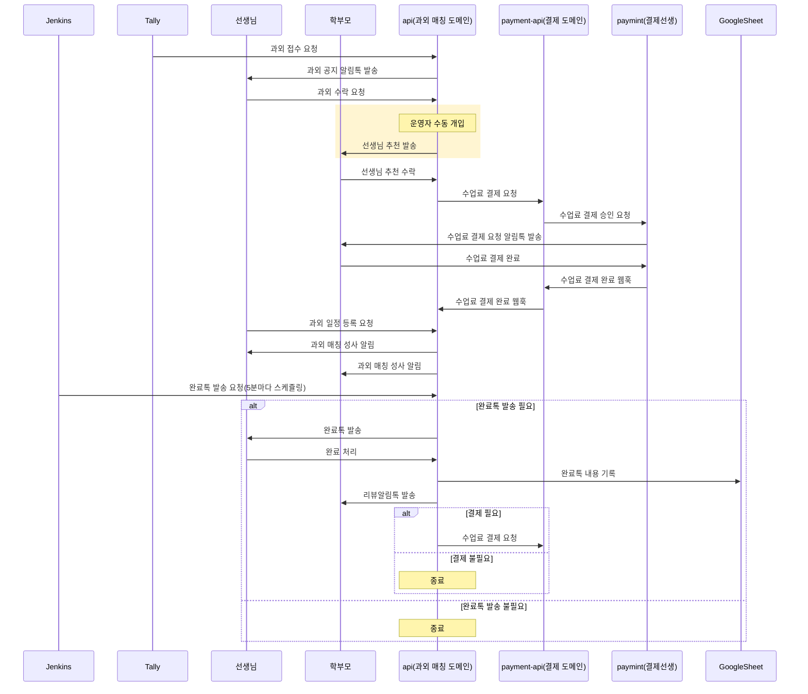
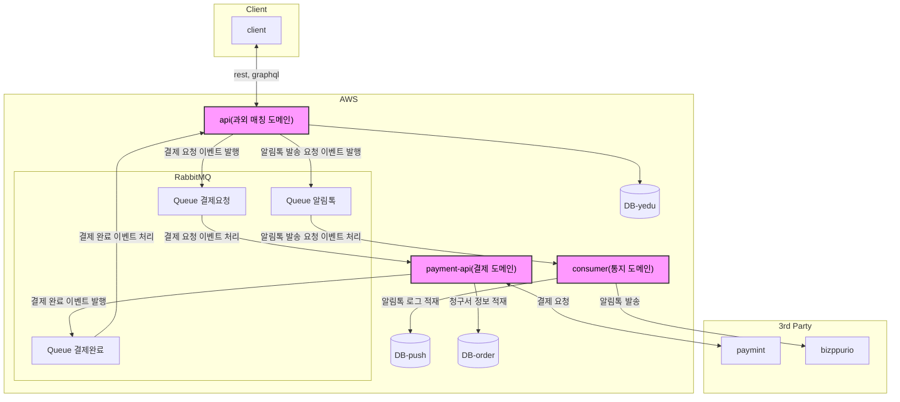

## 전체 구성도 (AS-IS)

```mermaid
graph TD
    %% 노드 정의
    client["client"]
    api["api(과외 매칭 도메인)"]
    consumer["consumer(통지 도메인)"]
    payment-api["payment-api(결제 도메인)"]
    rabbitmq["rabbitmq"]
    db[(DB-yedu)]
    push-db[(DB-push)]
    order-db[(DB-order)]
    jenkins[jenkins]
    paymint[paymint]
    bizppurio[bizppurio]
    
    %% 그룹핑 (subgraph)
    subgraph "Client"
        client
    end

    subgraph "AWS"
        api 
        db
        push-db
        order-db
        consumer
    end 
    
    subgraph "On-Premise"
        rabbitmq
        payment-api
        jenkins
    end
    
    
    subgraph "3rd Party"
        paymint
        bizppurio
    end

    %% 관계 정의
    jenkins --scheduling 작업--> api
    client <--rest, graphql--> api
    
    api --> rabbitmq
    api --> db
    api <--결제--> payment-api
    
    consumer --알림톡 로그 적재--> push-db
    consumer --> bizppurio
    
    payment-api --> order-db
    payment-api --> paymint
    
    rabbitmq --> consumer

    %% 스타일 정의
    classDef server fill:#f9f,stroke:#333,stroke-width:2px,color:#000;
    class api,consumer,payment-api server
```
- aws, on-premise 일부 혼재

## 서비스 Flow

```mermaid
sequenceDiagram
    participant Jenkins
    participant Tally
    participant T as 선생님 
    participant P as 학부모
    participant API as api(과외 매칭 도메인)
    participant PaymentAPI as payment-api(결제 도메인)
    participant Paymint as paymint(결제선생)
    participant GoogleSheet

    %% 초기 요청 흐름
    Tally->>API: 과외 접수 요청
    API->>T : 과외 공지 알림톡 발송
    T->>API : 과외 수락 요청

    %% 운영자 추천 발송 영역
    rect rgb(255, 245, 210)
    Note over API: 운영자 수동 개입
    API->>P : 선생님 추천 발송
    end

    %% 과외 매칭 진행
    P->>API : 선생님 추천 수락
    API->>PaymentAPI : 수업료 결제 요청
    PaymentAPI->>Paymint : 수업료 결제 승인 요청
    Paymint->>P : 수업료 결제 요청 알림톡 발송
    P->>Paymint : 수업료 결제 완료
    Paymint->>PaymentAPI : 수업료 결제 완료 웹훅
    PaymentAPI->>API : 수업료 결제 완료 웹훅

    %% 과외 매칭 결과 알림
    T->>API : 과외 일정 등록 요청
    API->>T: 과외 매칭 성사 알림
    API->>P: 과외 매칭 성사 알림

    %% 일정 생성 플로우
    Jenkins->>API: 완료톡 발송 요청(5분마다 스케쥴링)
    %% 조건 분기 - 완료톡 발송 여부 판단
    alt 완료톡 발송 필요
        API->>T: 완료톡 발송
        T->>API: 완료 처리
        API->>GoogleSheet: 완료톡 내용 기록
        API->>P: 리뷰알림톡 발송
        %% 조건 분기 - 결제 여부 판단
        alt 결제 필요
            API->>PaymentAPI: 수업료 결제 요청
        else 결제 불필요
            Note over API: 종료
        end
    else 완료톡 발송 불필요
        Note over API: 종료
    end


```

## 전체 구성도 (TO-BE)

```mermaid
graph TD
    %% 노드 정의
    client["client"]
    api["api(과외 매칭 도메인)"]
    consumer["consumer(통지 도메인)"]
    payment-api["payment-api(결제 도메인)"]
    
    db[(DB-yedu)]
    push-db[(DB-push)]
    order-db[(DB-order)]

    paymint[paymint]
    bizppurio[bizppurio]

    %% RabbitMQ Queues
    queue-request["Queue 결제요청"]
    queue-complete["Queue 결제완료"]
    queue-alarmtalk["Queue 알림톡"]

    %% 그룹핑
    subgraph "Client"
        client
    end

    subgraph "AWS"
        api 
        consumer
        payment-api
        db
        push-db
        order-db
        subgraph "RabbitMQ"
            queue-request
            queue-complete
            queue-alarmtalk
        end
    end


    subgraph "3rd Party"
        paymint
        bizppurio
    end

    %% 관계 정의
    client <--rest, graphql--> api

    %% EDA: 결제 요청 흐름
    api --결제 요청 이벤트 발행--> queue-request
    api --알림톡 발송 요청 이벤트 발행--> queue-alarmtalk
    api --> db

    queue-request --결제 요청 이벤트 처리--> payment-api
    queue-alarmtalk --알림톡 발송 요청 이벤트 처리--> consumer

    %% 결제 처리 및 webhook
    payment-api <-- 결제 요청 --> paymint
    payment-api -- 결제 완료 이벤트 발행 --> queue-complete
    queue-complete --결제 완료 이벤트 처리 --> api

    payment-api --청구서 정보 적재--> order-db

    consumer -- 알림톡 로그 적재 --> push-db
    consumer -- 알림톡 발송 --> bizppurio

    %% 스타일 정의
    classDef server fill:#f9f,stroke:#333,stroke-width:2px,color:#000;
    class api,consumer,payment-api server
```
